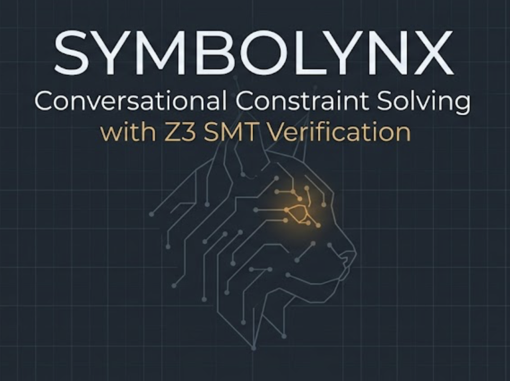
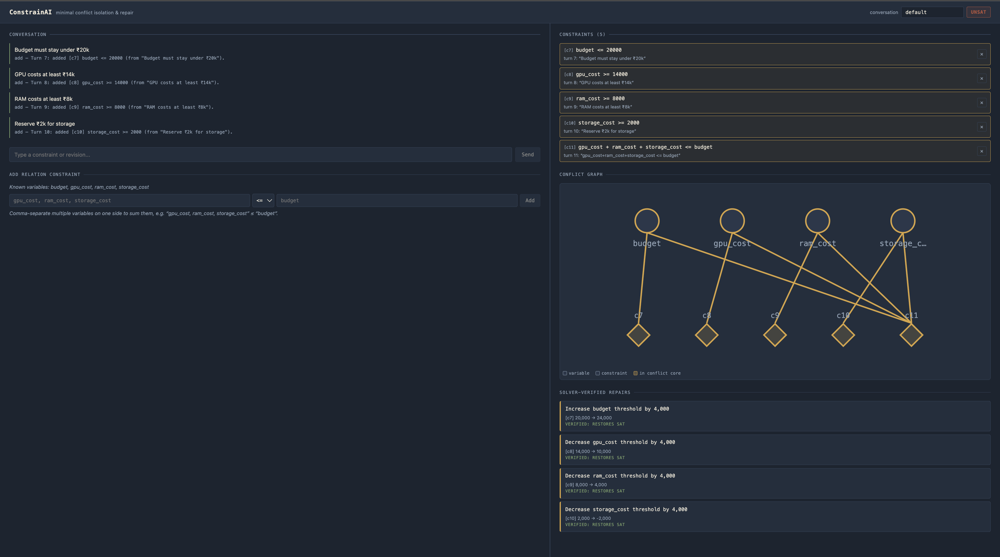

<p align="center">
  
</p>


<h1 align="center"> SymboLynx </h1>

<h2 align="center"> Conversational Constraint Solving with Minimal Conflict Isolation and Repair </h2>
<p align="center">
  
  
  
  
  
  
</p>
SymboLynx allows users to state complex planning, budgeting, or scheduling requirements in plain English and receive mathematically verified answers. If the specified constraints are impossible to satisfy, SymboLynx does not guess—it isolates the exact, absolute subset-minimal conflict down to the sentences typed and computes precise, solver-verified mathematical repairs.

Unlike traditional "AI planning" configurations that rely blindly on Large Language Models (LLMs) to reason—a process fundamentally prone to hallucinations—SymboLynx splits the problem in two: a **fuzzy layer** for parsing text and a **rigid layer** for proving the math. 

---

## 🏗️ Architecture & Philosophy

Most conversational systems reason about constraints entirely within the natural language space, treating pattern completion as theorem proving. SymboLynx enforces a strict neuro-symbolic separation of concerns:

1. **Deterministic Extraction:** Natural language is converted into a structured, typed Intermediate Representation (IR) via deterministic pattern matching. If a phrasing is unrecognized, it fails safely and transparently rather than guessing.
2. **Formal Verification Core:** The structured IR is compiled into mathematical terms and fed directly to **Z3** (an SMT Solver used in hardware and compiler verification). Every SAT/UNSAT verdict is a mathematical certainty.
```
Natural language input
      │
      ▼
Deterministic extraction (regex/rules, no LLM)
      │
      ▼
Typed Constraint IR (Pydantic) ──── provenance: turn, source text
      │
      ▼
Constraint Store ──── lifecycle: active / superseded / retracted
      │                          (persisted to SQLite per conversation)
      ▼
Z3 Compiler ──── Expression tree → Z3 arithmetic terms
      │
      ▼
Tracked Solver ──── SAT/UNSAT check
      │
      ├── SAT ──► satisfying model returned
      │
      └── UNSAT ──► raw unsat core (Z3, not guaranteed minimal)
                        │
                        ▼
                   Deletion-based shrinking
                        │
                        ▼
                   Subset-minimal conflict (independently verified)
                        │
                        ▼
                   Z3-optimization repair engine
                   (tightest fix per constraint, verified by re-solving)
```

### Key Technical Pillars

* **Double-Verified Minimality:** Z3's raw `unsat_core` is not guaranteed to be minimal. SymboLynx passes the core through a secondary deletion-based shrinking algorithm to achieve a *subset-minimal* conflict. This boundary is then independently re-verified from scratch to ensure an algorithmic bug never yields a false minimal claim.
* **Optimization-Driven Repairs:** Instead of generating conversational suggestions, the repair engine uses Z3's optimizer to solve a linear program: *holding all other constraints fixed, what is the tightest possible relaxation to this specific bound to restore satisfiability?* The computed delta is then verified by injecting it back into a fresh instance of the solver.
* **Full Audit Trail:** Constraints are never destructively erased. Retractions and revisions update a constraint's lifecycle state (`active`, `superseded`, `retracted`) inside an immutable-history store, tracking provenance back to the precise conversation turn.

---

## 📂 Project Structure

The repository is structured around a decoupled, pure-Python reasoning core with zero web framework dependencies:

```text
constrainai/          # Core reasoning engine (SymboLynx Core)
  ├── expressions.py  # Typed arithmetic expression trees (Var, Const, Sum, Diff)
  ├── constraints.py  # Constraint IR: schemas, provenance, hardness, and status
  ├── store.py        # In-memory constraint store and lifecycle state transitions
  ├── compiler.py     # Translation layer: Expression/Constraint IR -> Z3 terms
  ├── solver.py       # Tracked SAT/UNSAT checking management
  ├── unsat_core.py   # Raw Z3 UNSAT core extraction 
  ├── shrink.py       # Deletion-based subset-minimal core shrinking + verification
  ├── repair.py       # Z3-optimization-based, solver-verified repair calculations
  ├── extraction.py   # Deterministic natural language parsing rules
  └── persistence.py  # SQLite storage manager using SQLAlchemy
api/                  # FastAPI production service layer
frontend/             # Next.js SPA UI (Chat interface, constraint sidebar, conflict graph)
evaluation/           # Evaluation harness for precision, recall, and accuracy metrics
tests/                # 82 automated integration tests (Zero mocks; real Z3 & DB paths)
demo.py               # E2E Command-line interactive walkthrough
```
## ⚡ Tech Stack

|  |  |  |  |  |  |
|:---:|:---:|:---:|:---:|:---:|:---:|
| Core Engine / Pydantic IR | High-Performance API | Formal Verification Core | Frontend Interface / React | Persistence Layer / SQLAlchemy | Automated Integration Testing |

## 🚀 Getting Started
<details> 
<summary><b>Click here for instructions to run this project yourself.</b></summary>

**Backend:**
```bash
python3 -m venv venv
source venv/bin/activate          # Windows: venv\Scripts\activate
pip install -r requirements.txt
python3 -m pytest                  # 82 tests
uvicorn api.main:app --reload --port 8000
```
 
**Frontend** (separate terminal):
```bash
cd frontend
npm install
cp .env.local.example .env.local
npm run dev
```
Open `http://localhost:3000`.
 
**CLI demo** (no server needed):
```bash
python3 demo.py
```
 
**Evaluation harness:**
```bash
python3 -m evaluation.runner
```
</details>

## Example walkthrough
 <details> 

   State four constraints in the chat:
```
Budget must stay under ₹20k
GPU costs at least ₹14k
RAM costs at least ₹8k
Reserve ₹2k for storage
```
Then tie them together with the relation form (`gpu_cost, ram_cost,
storage_cost` ≤ `budget`). The system detects UNSAT, identifies that all
five statements are jointly necessary for the conflict (removing any one
resolves it), and proposes four independently-verified repairs — each
closing the same ₹4,000 shortfall from a different direction.
 
Retract the RAM requirement ("Ignore my previous RAM requirement") or
revise the budget upward ("Actually increase budget to ₹27k") and the
system re-solves to SAT, live.
</details> 

## Evaluation results
 <details> 

<p align="center">
  
</p>
Run against 23 extraction turns and 6 conflict scenarios spanning
budgeting, scheduling, and hardware-configuration domains:
 
| Metric | Result |
|---|---|
| Extraction precision / recall | 100% / 100% |
| SAT/UNSAT accuracy | 100% |
| Exact conflict-set match rate | 100% |
| Repair validity (solver-verified) | 100% |
| Solver latency @ 500 constraints | ~57ms |
</details>

## 🤝 How to Contribute

Contributions are welcome! SymboLynx is an ongoing initiative to bridge the gap between flexible natural language processing and rigorous, deterministic formal verification. If you want to help expand its capabilities, feel free to fork the repository and submit a pull request.

### 🎯 Targeted Areas for Contribution

#### 1. Expand the Typed IR & Solver Coverage
* **Set-Membership Operators:** Implement compilation down to Z3 assertions for the pre-defined boolean set-membership structures (`REQUIRES`, `EXCLUDES`).
* **Non-Linear Systems:** Generalize the `compiler.py` and expression tree architectures to support non-linear relation constraints (e.g., multiplication of variables or power constraints).
* **Domain Bounding Clamping:** Build out automatic lower/upper domain clamping systems to prevent the repair engine from proposing physically impossible values (like negative costs).

#### 2. Robust Deterministic NLP Parsing
* **Context-Free Grammars (CFG):** Upgrade `extraction.py` from native regular expressions to a robust, deterministic CFG parser (using frameworks like `Lark`) to extend the phrasing vocabulary without sacrificing reproducibility.
* **Multi-sentence Extraction:** Add state tracking to resolve multi-sentence context dependencies (e.g., *"Budget is 20k. Hardware must consume at least half of it."*).

#### 3. Frontend & Graph Visualization Enhancement
* **Interactive Conflict Resolution:** Enable users to click directly on a proposed repair within the `ConflictGraph` UI to auto-inject the change back into the solver as a conversational `revise` mutation.
* **State Timeline Scrubber:** Build a structural timeline UI component that allows developers to browse and inspect the constraint store across execution turns historical snapshots.

#### 4. Hardening the Evaluation Harness
* **Synthetic Test Generator:** Construct a property-based fuzzing script within `evaluation/` to automatically generate hundreds of chained, complex constraint paths to stress-test Z3 solving latency.

---
 ## License
 
MIT— see [LICENSE](LICENSE).
 
